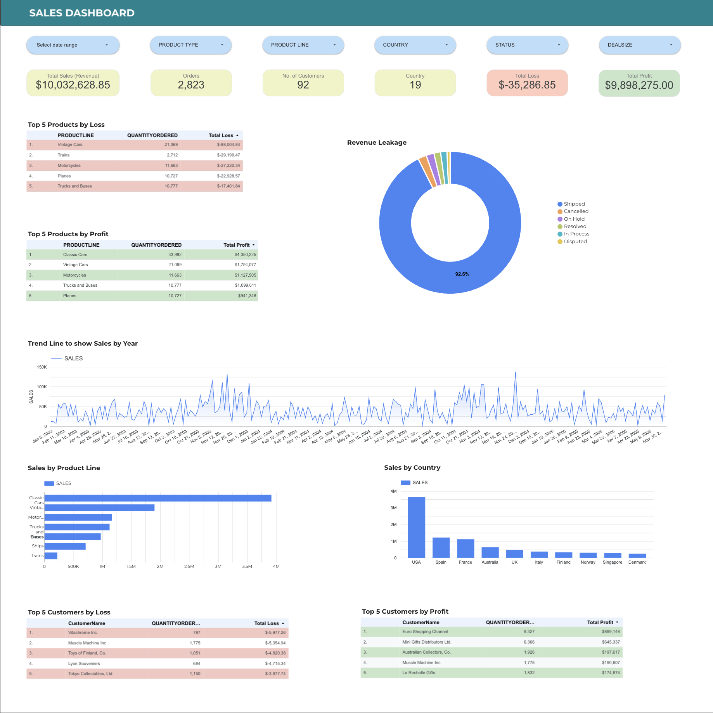

## Sales Dashboard Analysis

This project analyzes a real sales dataset and presents insights through a clear, decision-focused dashboard.

### Objective
- Understand sales performance
- Identify trends and key drivers
- Present insights in a simple, actionable way

### Tools Used
- Google Looker Studio
- Excel / CSV

### Key Focus
- KPI-driven metrics
- Clarity over complexity
- Business-oriented insights

### Preview

Feedback and discussions are welcome.
